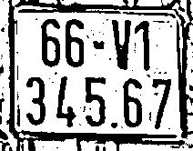

# License Plate Preprocessing for OCR

Tài liệu giải thích từng bước preprocessing ảnh biển số để chuẩn bị cho OCR.

## 📋 Mục đích

Preprocessing giúp:
- Tăng độ chính xác của OCR
- Loại bỏ noise và nhiễu
- Làm nổi bật text trên nền
- Chuẩn hóa kích thước và chất lượng ảnh

## 🚀 Cách chạy

```bash
python demo_preprocess_simple.py
```

**Input:** `./outputs/crops/plate_001.jpg`  
**Output:** `./outputs/demo/` (5 file ảnh từng bước)

### 📸 Ảnh mẫu

**Input (ảnh gốc):**


**So sánh tất cả các bước (từ trái sang phải):**

| Input | Step 1: Gray | Step 2: Resize | Step 3: Blur | Step 4: Threshold | Step 5: Morphology |
|-------|--------------|----------------|--------------|-------------------|-------------------|
|  |  |  |  |  |  |

---

## 📝 Các bước Preprocessing

### Bước 1: Grayscale (Chuyển sang ảnh xám)

```python
gray = cv2.cvtColor(img, cv2.COLOR_BGR2GRAY)
```

**Mục đích:**
- Giảm từ 3 kênh màu (BGR) xuống 1 kênh (grayscale)
- Giảm độ phức tạp xử lý
- OCR chỉ cần thông tin độ sáng, không cần màu sắc

**Kết quả:** `01_gray.jpg`


---

### Bước 2: Resize (Phóng to ảnh)

```python
h, w = gray.shape
scale = 2
resized = cv2.resize(gray, (w * scale, h * scale), interpolation=cv2.INTER_CUBIC)
```

**Mục đích:**
- Phóng to ảnh lên **2 lần** (scale = 2)
- Giúp OCR đọc được các ký tự nhỏ
- `INTER_CUBIC`: interpolation chất lượng cao, làm mịn khi phóng to

**Tham số:**
- `scale = 2`: nhân đôi kích thước
- `interpolation=cv2.INTER_CUBIC`: thuật toán nội suy tốt nhất

**Kết quả:** `02_resize.jpg`


---

### Bước 3: Gaussian Blur (Làm mịn)

```python
blur = cv2.GaussianBlur(resized, (5, 5), 0)
```

**Mục đích:**
- Làm mịn ảnh, giảm noise nhỏ
- Chuẩn bị cho bước threshold
- Kernel size `(5, 5)`: vùng làm mịn 5x5 pixels

**Tham số:**
- `(5, 5)`: kích thước kernel (lớn hơn = mịn hơn nhưng mất chi tiết)
- `0`: sigma tự động tính từ kernel size

**Kết quả:** `03_blur.jpg`


---

### Bước 4: Adaptive Threshold (Nhị phân hóa thích ứng)

```python
thresh = cv2.adaptiveThreshold(
    blur, 
    255,                          # max value
    cv2.ADAPTIVE_THRESH_GAUSSIAN_C,  # method
    cv2.THRESH_BINARY,            # type
    11,                           # block size
    2                             # C constant
)
```

**Mục đích:**
- Chuyển ảnh xám thành **ảnh nhị phân** (đen/trắng)
- **Adaptive**: tự động điều chỉnh ngưỡng theo từng vùng
- Quan trọng nhất cho OCR - làm nổi bật text

**Tham số:**
- `255`: giá trị pixel trắng (max)
- `ADAPTIVE_THRESH_GAUSSIAN_C`: dùng Gaussian để tính ngưỡng
- `THRESH_BINARY`: pixel > ngưỡng → trắng, ngược lại → đen
- `11`: block size - tính ngưỡng trong vùng 11x11 pixels
- `2`: C constant - trừ đi từ ngưỡng để điều chỉnh

**Kết quả:** `04_thresh.jpg` (ảnh đen trắng rõ ràng)


---

### Bước 5: Morphology (Làm sạch noise)

```python
kernel = np.ones((3, 3), np.uint8)
morph = cv2.morphologyEx(thresh, cv2.MORPH_CLOSE, kernel, iterations=1)
```

**Mục đích:**
- **MORPH_CLOSE**: đóng các lỗ nhỏ trong ký tự
- Làm liền các phần bị đứt của chữ
- Loại bỏ noise nhỏ

**Tham số:**
- `kernel (3, 3)`: ma trận 3x3 để xử lý
- `MORPH_CLOSE`: dilation rồi erosion (đóng → mở)
- `iterations=1`: số lần áp dụng

**Kết quả:** `05_morph.jpg` (ảnh cuối cùng, sẵn sàng cho OCR)


---

## 📊 Pipeline tổng quan

```
Ảnh màu (BGR)
    ↓
[1] Grayscale      → Ảnh xám
    ↓
[2] Resize (2x)    → Ảnh lớn hơn
    ↓
[3] Gaussian Blur  → Ảnh mịn
    ↓
[4] Adaptive Threshold → Ảnh nhị phân (đen/trắng)
    ↓
[5] Morphology     → Ảnh sạch, sẵn sàng OCR
```

---

## 🎯 Kết quả

Sau 5 bước, bạn có:
- **Ảnh nhị phân** rõ ràng (đen/trắng)
- **Text nổi bật** trên nền
- **Noise đã được loại bỏ**
- **Kích thước phù hợp** cho OCR

**File cuối cùng:** `05_morph.jpg` → Đưa vào OCR engine

---

## 💡 Tips điều chỉnh

### Nếu text quá mờ:
- Tăng `scale` trong Resize (2 → 3 hoặc 4)
- Giảm `block size` trong Adaptive Threshold (11 → 9)

### Nếu có nhiều noise:
- Tăng kernel size trong Blur: `(5,5)` → `(7,7)`
- Tăng `iterations` trong Morphology: `1` → `2`

### Nếu text bị đứt:
- Giảm `C constant` trong Threshold: `2` → `1`
- Tăng `iterations` trong Morphology: `1` → `2`

---

## 📁 Cấu trúc file

```
outputs/
├── crops/              # Ảnh input (biển số đã crop)
│   └── plate_001.jpg
└── demo/               # Ảnh output từng bước
    ├── 01_gray.jpg
    ├── 02_resize.jpg
    ├── 03_blur.jpg
    ├── 04_thresh.jpg
    └── 05_morph.jpg    # ← Dùng cho OCR

docs/                    # Ảnh demo cho README
├── input.jpg           # Ảnh input mẫu
├── 01_gray.jpg
├── 02_resize.jpg
├── 03_blur.jpg
├── 04_thresh.jpg
└── 05_morph.jpg
```

---

## 🔍 Code core nhất

File `demo_preprocess_simple.py` chứa code đơn giản nhất, dễ hiểu từng bước:
- Không có abstraction phức tạp
- Hard code đường dẫn
- Linear flow, dễ debug
- Phù hợp để học và test

File `step3_preprocess_plates.py` là version production:
- Xử lý nhiều ảnh cùng lúc
- Có error handling
- Type hints đầy đủ
- Phù hợp để chạy batch

