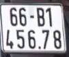

# 🚗 License Plate Detection with YOLOv8

A simple and clean implementation for detecting and cropping license plates from images using **YOLOv8 + OpenCV**.  
Optimized for **ALPR research, self-learning, and graduation thesis projects**.

---

## 📋 Overview

This project uses YOLOv8 to detect license plates in images and automatically crops them into separate files. Perfect for:

- **Research projects** on Automatic License Plate Recognition (ALPR)
- **Learning** computer vision and object detection
- **Thesis projects** requiring license plate detection

### 🎯 What it does:

1. **Input**: An image containing one or more license plates
2. **Detection**: YOLOv8 detects all license plates in the image
3. **Output**:
   - Individual cropped license plate images
   - Debug visualization with bounding boxes

### 📸 Example Results

**Input Image:**


**Detection Result (with bounding boxes):**


**Cropped License Plates:**
| Plate 1 | Plate 2 | Plate 3 | Plate 4 |
|---------|---------|---------|---------|
|  |  |  |  |

---

## 📦 Environment Setup (Using Conda - Recommended)

> **Why Conda?** Conda is highly recommended for deep learning projects due to **better dependency management, CUDA compatibility, and reproducibility**.

---

## 1. Create Conda Environment

Create a new conda environment with Python 3.10:

```bash
conda create -n alpr python=3.10 -y
```

**Activate the environment:**

```bash
conda activate alpr
```

**Verify Python version:**

```bash
python --version
```

**Expected output:**

```
Python 3.10.x
```

---

## 2. Install PyTorch

### 🔥 With NVIDIA GPU (Recommended)

If you have an NVIDIA GPU, install PyTorch with CUDA support for faster inference:

```bash
conda install pytorch torchvision torchaudio pytorch-cuda=12.1 -c pytorch -c nvidia -y
```

**Verify GPU availability:**

```bash
python - << EOF
import torch
print("CUDA Available:", torch.cuda.is_available())
print("GPU:", torch.cuda.get_device_name(0) if torch.cuda.is_available() else "None")
EOF
```

**Expected output:**

```
CUDA Available: True
GPU: RTX ...
```

### 🐢 CPU Only (No GPU)

If you don't have a GPU or want to use CPU only:

```bash
conda install pytorch torchvision torchaudio cpuonly -c pytorch -y
```

> **Note:** CPU inference will be slower but works on any machine.

---

## 3. Install YOLOv8 & OpenCV

Install the required packages:

```bash
pip install ultralytics opencv-python
```

**Verify installation:**

```bash
python -c "from ultralytics import YOLO; import cv2; print('OK')"
```

If you see `OK`, the installation is successful!

---

## 📁 Project Structure

```
learn/
│
├── model/
│   └── best.pt              # YOLOv8 trained model
│
├── img/
│   └── multi_plates.png     # Input test image
│
├── outputs/
│   ├── crops/               # Cropped license plates (output)
│   └── debug/               # Debug visualization (output)
│
├── examples/                # Sample images for documentation
│   ├── input_sample.png     # Input example
│   ├── output_debug.jpg     # Detection visualization
│   └── plate_*.jpg          # Cropped plates examples
│
├── main.py                  # Main detection script
└── README.md                # This file
```

---

## ▶ How to Use

### Step 1: Prepare Your Image

Place your image in the `img/` folder, or update the `IMAGE_PATH` in `main.py`.

### Step 2: Run Detection

```bash
python main.py
```

### Step 3: Check Results

After running, you'll find:

- **Cropped license plates** in: `outputs/crops/`
  - Files named: `plate_0.jpg`, `plate_1.jpg`, `plate_2.jpg`, etc.
- **Debug visualization** in: `outputs/debug/debug_detection.jpg`
  - Shows the original image with bounding boxes around detected plates

### Example Console Output:

```
[INFO] Loading YOLOv8 model...
[INFO] Loading image...
[INFO] Image size: 1920x1080
[INFO] Running detection...

============================================================
[PLATE 0]
Class      : license_plate
Confidence : 0.9234
Box        : (245, 180) -> (420, 230)
[SAVED] outputs/crops/plate_0.jpg
...

====================== DONE ======================
[INFO] Total plates detected: 4
[INFO] Debug image saved at: outputs/debug/debug_detection.jpg
[INFO] Crops saved in: outputs/crops
==================================================
```

---

## ⚡ Quick Install (One-liner)

For experienced users, here's a one-liner to set up everything:

```bash
conda create -n alpr python=3.10 -y && conda activate alpr && conda install pytorch torchvision torchaudio pytorch-cuda=12.1 -c pytorch -c nvidia -y && pip install ultralytics opencv-python
```

---

## 🔧 Configuration

You can customize the detection by editing `main.py`:

```python
MODEL_PATH = "./model/best.pt"        # Path to your YOLOv8 model
IMAGE_PATH = "./img/multi_plates.png" # Input image path
CROP_DIR = "./outputs/crops"          # Output directory for crops
DEBUG_DIR = "./outputs/debug"         # Output directory for debug images
```

---

## 🔁 Export / Rebuild Environment (For Thesis & Reproducibility)

### Export Environment:

Save your environment configuration for sharing or reproducibility:

```bash
conda env export > environment.yml
```

### Rebuild Environment:

Recreate the environment from the exported file:

```bash
conda env create -f environment.yml
```

This is especially useful for:

- **Thesis documentation** - Include `environment.yml` in your project
- **Reproducibility** - Others can recreate your exact environment
- **Backup** - Save your working configuration

---

## 📝 Notes

- The model file (`best.pt`) should be placed in the `model/` folder
- Supported image formats: `.jpg`, `.png`, `.jpeg`
- The script automatically creates output directories if they don't exist
- Detection confidence threshold can be adjusted in the model inference

---

## 🤝 Contributing

Feel free to fork, modify, and use this project for your research or learning purposes!

---

## 📄 License

This project is provided as-is for educational and research purposes.
